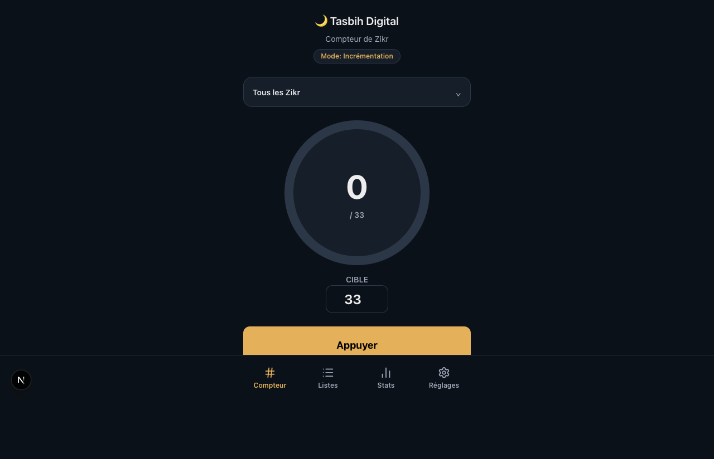
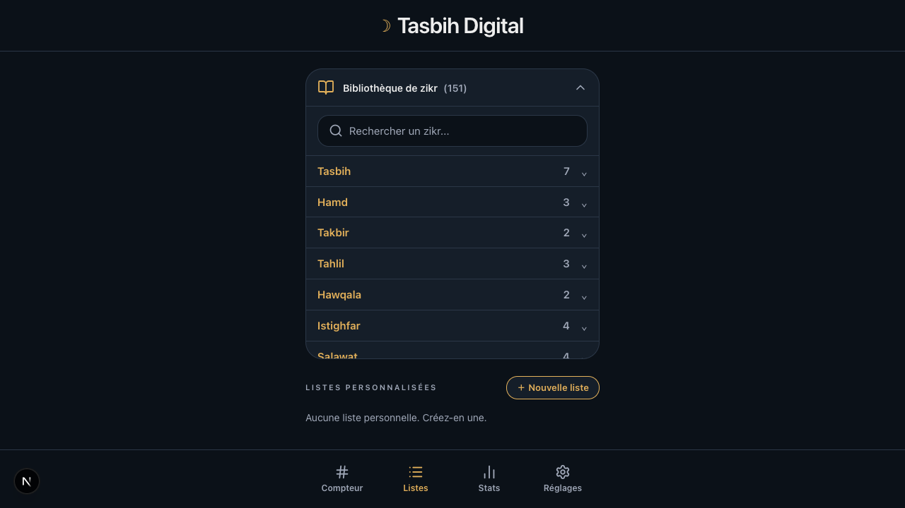
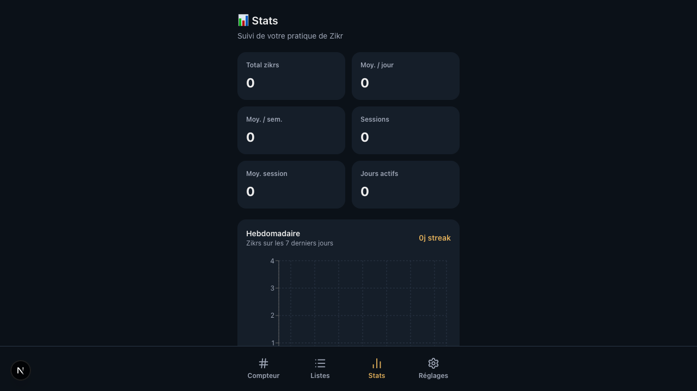
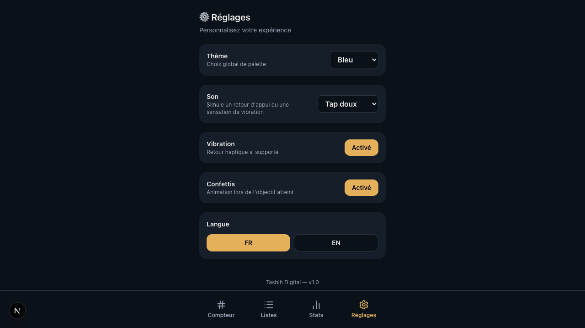

# Tasbih Digital

Tasbih Digital is a mobile-first zikr counter built with Next.js. It provides a focused counter experience, custom zikr lists, lightweight stats, theme and feedback preferences, and production PWA support.

## Overview

- Mobile-first interface optimized for touch interaction
- Built-in zikr library with Arabic, transliteration, and French/English translations
- Increment and decrement counting modes
- Personal lists with manual zikr entries
- Session history and weekly statistics
- Persistent local state with no backend required
- Installable PWA in production builds

## Screenshots









## Tech Stack

- Next.js 16 App Router
- React 19
- TypeScript
- Tailwind CSS v4
- Zustand for persisted client state
- Framer Motion for UI motion
- Recharts for statistics charts
- next-pwa for production service worker registration

## Main Features

### Counter

The main screen is a tap-first tasbih counter with:

- up/down modes
- target-based progress
- undo and reset actions
- zikr selection from the built-in library
- support for running a full custom list step by step
- optional haptics, tap sound, and confetti when a goal is reached

### Lists

The lists screen lets users:

- browse the bundled zikr library by category
- search by Arabic, transliteration, or translation
- create personal lists
- rename and delete personal lists
- add manual zikr items with custom repetition counts
- edit and reorder manual content inside a list flow

### Stats

The stats screen tracks locally stored usage data, including:

- total zikr count
- session count
- active days
- average per day, week, and session
- 7-day chart
- streak calculation
- recent session history

### Settings

The settings screen supports:

- theme switching: `light`, `dark`, `blue`
- language switching: French and English
- vibration toggle
- tap sound selection
- confetti toggle

## Persistence Model

Application state is stored in `localStorage` through the Zustand store in `store/tasbihStore.ts`.

Persisted data includes:

- current zikr and counter state
- custom lists and manual zikr entries
- session history and stats
- UI preferences such as theme, language, sound, vibration, and confetti

This project currently does not use a server, database, or authentication layer.

## PWA Notes

- Web app manifest: `public/manifest.json`
- PWA plugin: `next-pwa`
- Service worker registration is enabled in production only
- PWA features are disabled automatically during local development

## Project Structure

```text
app/
	page.tsx            Counter screen
	listes/page.tsx     Personal lists and zikr library
	stats/page.tsx      Stats dashboard
	reglages/page.tsx   Preferences
components/           Shared UI pieces
data/zikrs.ts        Built-in zikr library and default lists
hooks/useT.ts         Translation helper
i18n/translations.ts  French and English UI strings
store/tasbihStore.ts  Global persisted state
public/manifest.json  PWA manifest
scripts/              Utility scripts such as icon generation
```

## Getting Started

### Requirements

- Node.js 20+
- npm

### Install

```bash
npm install
```

### Run Development Server

```bash
npm run dev
```

Open `http://localhost:3000`.

### Production Build

```bash
npm run build
npm run start
```

### Lint

```bash
npm run lint
```

### E2E Smoke Tests

```bash
npm run test:e2e:smoke
```

## Deployment

The app can be deployed on any platform that supports Next.js. Vercel is the simplest option.

Notes:

- PWA registration is intended for production builds
- Because state is stored locally in the browser, user data does not sync across devices

## Product Notes

- The app is primarily designed for mobile viewport use
- iOS does not expose the same vibration support as Android browsers, so audio feedback is used as a fallback where available
- Themes are applied through CSS variables and synchronized at runtime

## Contributing

See `CONTRIBUTING.md` for contribution guidelines and pull request expectations.

## Legal Pages

- About page: `/about`
- Privacy policy page: `/privacy`

Both pages are designed to support app-store submission requirements where a public privacy URL is needed.

## Repository Setup

See `docs/repository-setup.md` for recommended GitHub labels, branch protection, and review settings.

## Roadmap Ideas

- import/export of user data
- optional cloud sync
- richer session insights
- more bundled curated zikr sets
